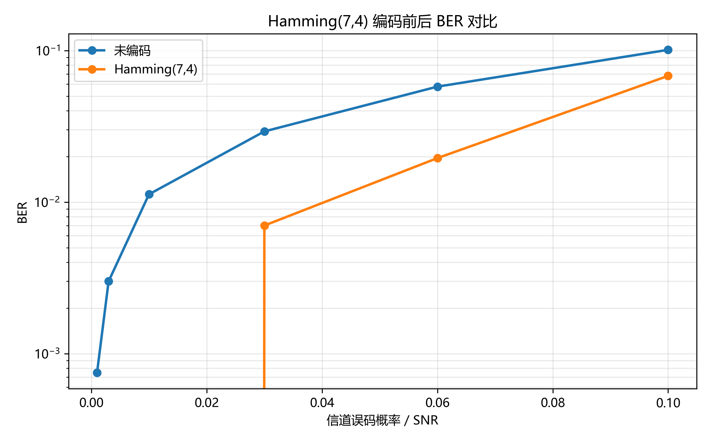
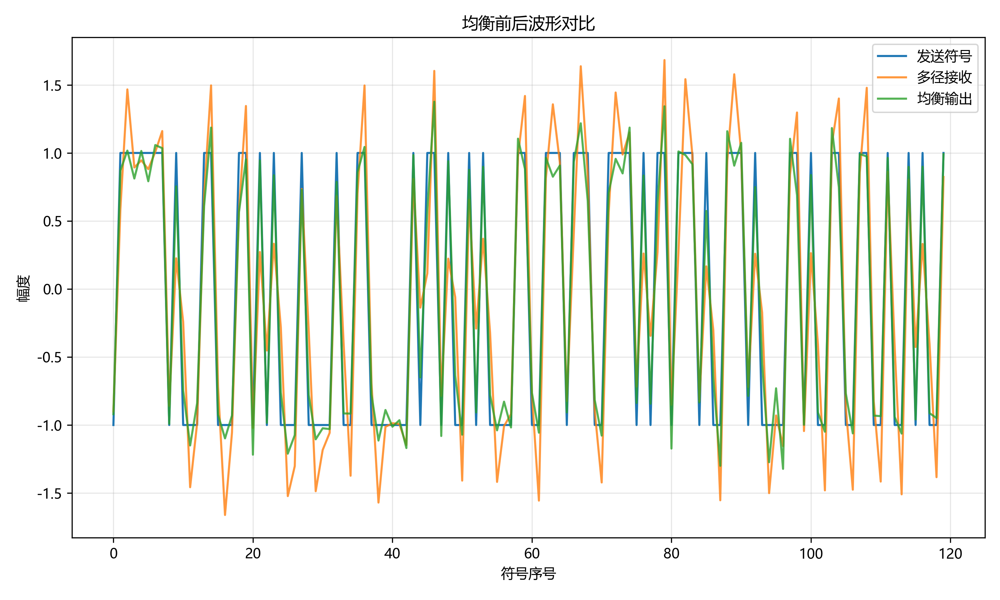
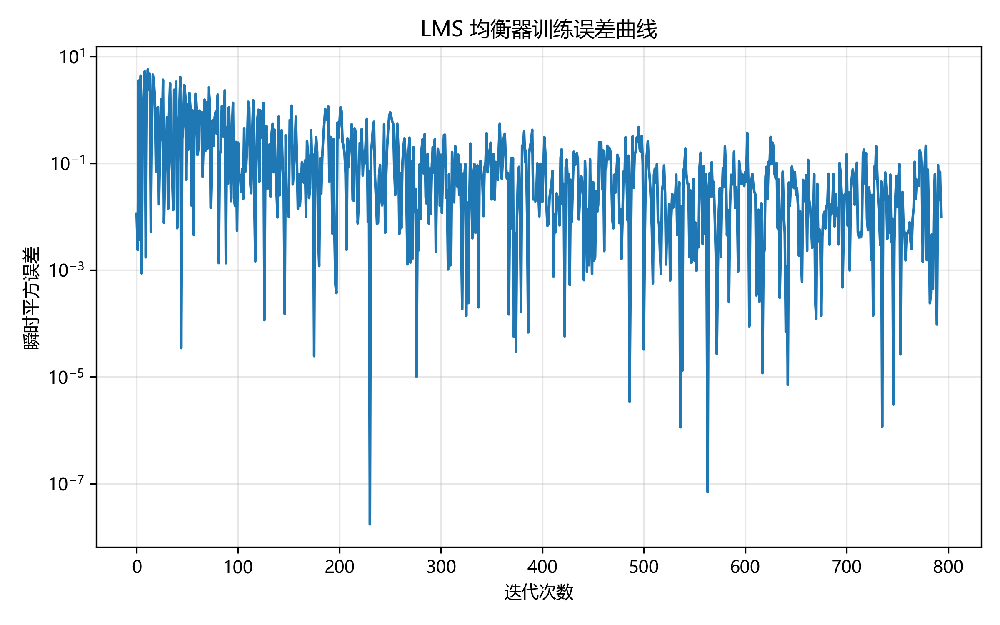

# 无线通信技术实验报告：信道编码与信道均衡

## 1. 实验目的

掌握 Hamming(7,4) 信道编码与单比特纠错的基本方法；理解多径信道导致的 ISI 以及 ZF/LMS 均衡器的设计与效果评估；熟悉使用 GitHub 自动评分与本地脚本进行实验结果验证，并能结合结果图进行解释与分析。

## 2. 实验原理

### 2.1 信道编码

Hamming(7,4) 是一种线性分组码，将 4 比特信息映射为 7 比特码字，通过冗余校验实现纠错能力。伴随式由接收码字与校验矩阵 $H$ 相乘得到，非零伴随式对应某一列，指示错误位置，从而实现单比特纠错。编码增益指在相同误码率下，编码系统相对未编码系统所需信噪比降低的程度。由于引入冗余，码率从 $4/7$ 降低，但可靠性提高，适合噪声较强的传输场景。

### 2.2 信道均衡

多径信道的冲激响应会在符号间产生叠加，导致符号间干扰（ISI）。ZF 均衡器通过设计 FIR 抽头使等效信道尽量逼近冲激响应，从而抵消 ISI，但在信道频谱深衰落处会放大噪声。LMS 自适应均衡器利用训练序列迭代更新抽头，使均衡输出逐步逼近期望符号，实现对未知或时变信道的跟踪。LMS 的收敛速度与稳态误差受步长影响，需要在稳定性与收敛速度之间权衡。

## 3. 实验环境

- Python 版本：3.x（Windows）
- 主要依赖：NumPy、Matplotlib、pytest
- AI 助手使用情况：使用 GitHub Copilot（GPT-5.2-Codex）协助理解实验要求与补全代码，但对关键算法与结果进行了自行验证与解释

## 4. 实验方法与步骤

### 4.1 Part 1：信道编码

1. 生成随机比特序列，并按 4 比特分组。
2. 使用 Hamming(7,4) 生成矩阵完成编码得到 7 比特码字。
3. 通过二元对称信道以不同翻转概率传输，得到带噪码字。
4. 计算伴随式并进行单比特纠错译码，取系统码前 4 位恢复信息比特。
5. 统计未编码与编码后的 BER，并绘制对比曲线，用于观察编码增益。

### 4.2 Part 2：信道均衡

1. 生成 BPSK 符号序列并通过多径 FIR 信道，加入噪声得到接收序列。
2. 使用最小二乘法估计 ZF 均衡器抽头作为参考。
3. 采用 LMS 算法，利用训练序列迭代更新均衡器抽头。
4. 通过均衡输出进行硬判决，计算均衡前后 BER，并绘制均衡波形与 LMS 误差曲线，观察 ISI 抑制效果与训练收敛过程。

## 5. 实验结果

插入结果图：

从 BER 曲线可见，Hamming(7,4) 编码在中低误码概率区域具有明显性能优势。均衡波形对比显示多径引起的畸变被 LMS 均衡器有效抑制，LMS 误差曲线随迭代下降，体现出自适应学习过程。

## 6. 结果分析与讨论

1. Hamming(7,4) 为什么能纠正单比特错误？
答：Hamming(7,4) 码的校验矩阵 $H$ 的每一列唯一对应一个比特位置，单比特错误会产生非零伴随式，且其值与某一列一致，因此可以定位并翻转该位完成纠错。

2. 为什么信道编码会引入冗余并降低码率？
答：编码通过添加校验位提升纠错能力，等价于用更多的比特表达相同信息量，因此码率降低为信息比特数与码长之比。

3. ZF 均衡为什么可能放大噪声？
答：ZF 追求消除 ISI，会在频域对信道的深衰落频点进行强增益补偿，从而同时放大噪声，导致噪声增强。

4. LMS 的步长过大或过小会出现什么问题？
答：步长过大会导致算法不稳定甚至发散；步长过小会收敛缓慢，训练时间变长，难以及时跟踪信道变化。

5. 均衡前后 ISI 有什么变化？
答：均衡后等效信道响应趋近冲激，符号间叠加减弱，ISI 明显减小，眼图开口增大，误码率下降。

## 7. 实验心得

通过本实验理解了分组码的纠错机理与多径信道均衡的核心思路。编码能够在噪声环境下提升可靠性，而均衡器可显著减轻 ISI 的影响。结合自动评分与结果可视化，能够快速定位问题并验证实现是否正确。AI 编程辅助主要用于梳理实现步骤与检查细节，提高了效率，但关键算法仍需自行理解与验证，确保结果可信。

## 8. 参考资料

- 课程课件：第6章 信道编码
- 课程课件：第7章 均衡
